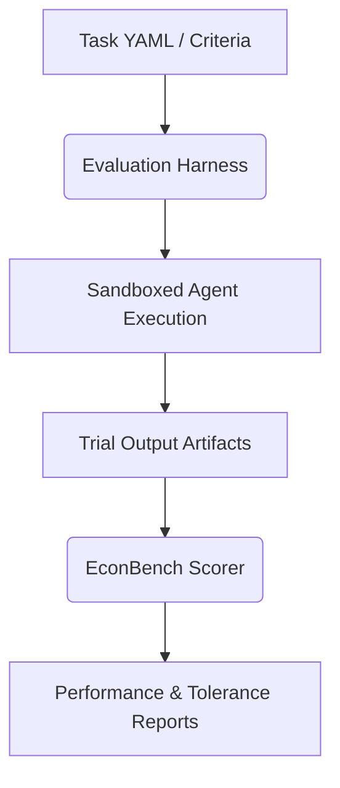

<div align="center">

# 🧪 Empirical Agent Evaluation & Scoring Suite

*An end-to-end framework for running, sandboxing, and scoring agentic LLMs on complex data-science and econometric replication tasks.*

[](https://www.python.org/)
[](https://www.docker.com/)
[](https://opensource.org/licenses/MIT)

**[Evaluation Harness](#-1-evaluation-harness-claude_empirical_harness)** • **[Scoring Engine](#-2-scoring-framework-econbench_framework)** • **[Architecture](#-architecture-workflow)** • **[Quick Start](#-quick-start)**

</div>

---

## 🧭 Overview

This suite combines two powerful tools designed to evaluate and verify agentic workflows in empirical research:

1. **`claude_empirical_harness`**: A sandboxed runner that executes agentic trials under strict constraints (such as isolated environments and no-shortcut data rules) to see how skills improve data-science and model-building performance.
2. **`econbench_framework`**: A YAML-driven scoring engine that grades agent replication outputs against verified econometric and panel data benchmarks.

---

## 📐 Architecture & Workflow



---

## 🚀 Projects Included

### 📂 1. Evaluation Harness ([`claude_empirical_harness`](file:///Users/simonfirestone/empirical_agent/claude_empirical_harness))
Measures agent performance improvement under custom environment constraints. 
* **Sandboxed Execution**: Spawns isolated environments using temporary directories and custom CLI wraps.
* **Auto & LLM-as-Judge Evaluation**: Supports deterministic regex/file checks along with rich LLM evaluation rubrics.
* **Features**:
  * Auto-check validation rules (row-count plausibility, file output presence).
  * Automated execution script running sequential trials.

### 📂 2. Scoring Framework ([`econbench_framework`](file:///Users/simonfirestone/empirical_agent/econbench_framework))
A benchmark-agnostic framework for grading empirical-analysis agent submissions.
* **YAML-Driven Configuration**: Fully custom parameters for variables, tolerances, panel times, and weights.
* **Included Benchmarks**: Features a pre-configured **Wallace AHS real-options housing investment** benchmark.
* **Features**:
  * One-time data staging caches.
  * Quantitative scoring models comparing outputs (regression coefficients, data construction logs) against ground-truth variables.

---

## 🛠️ Quick Start

### 1. Running an Agent Evaluation
To run a test trial and evaluate the agent's behavior:
```bash
# Run a trial on the SCF debt task
cd claude_empirical_harness
bash evals/run_eval.sh --task evals/tasks/scf_debt_age_income.yaml --runs 1 --condition both

# Grade the trial using the LLM-as-judge
python3 evals/score_trials.py --task evals/tasks/scf_debt_age_income.yaml --auto-judge
```

### 2. Scoring a Submission
To score an agent's submission folder against a benchmark:
```bash
# Stage benchmark data (one-time setup)
cd econbench_framework
python -m econbench.data --benchmark benchmarks/wallace/benchmark.yaml

# Run scoring engine on agent submission
python -m econbench.scorer \
  --benchmark benchmarks/wallace/benchmark.yaml \
  --submission examples/submissions/agent_run_001 \
  --output reports/agent_run_001_score.json
```

---

## 🔮 Future Roadmap
* [ ] **Unified Pipeline**: Integrate the scoring framework directly as an auto-checker step in the evaluation harness.
* [ ] **Multi-Agent Testing**: Support parallelized runs for comparing different system prompts and LLM backends (Claude, GPT, Gemini).
* [ ] **More Benchmarks**: Add additional macro/microeconomic paper replication packages.

---

<div align="center">
  <sub>Developed by Simon Firestone • 2026</sub>
</div>
